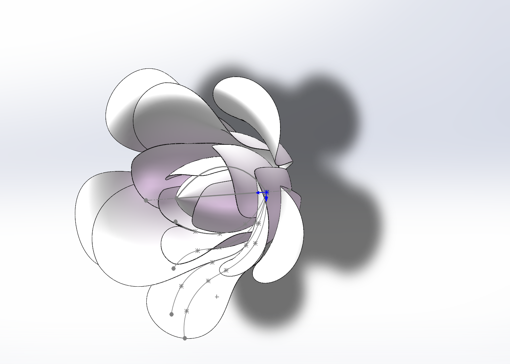

回忆“进化”历程

## 懵懂时期

刚进大学时，我被分到了智能制造专业，本质上还是偏机械材料。刚开始，我先自学了一下 `SW`。后来机缘巧合之下，作为硬件方向的人接触了智能车竞赛。当时我的想法很简单：机电不分家。

  

依稀记得，自己焊的第一块电路板是有刷双路驱动。那时候不懂元器件采购，买了不少假货；焊接的时候问题也特别多。更麻烦的是，当时我几乎不懂电路知识，出了问题根本不会修。

附上自己焊接的板子。顺便吐槽一下当时请教过的一位学长，其实他也不会。

  

那段时间，我基本就是电子厂水平，熟悉了各种操作流程，但完全没有深究原理。说白了，就是焊接工程师，而且技术还不太行。好在胜在勤劳，各种翘课练焊，最后混成了“威海电焊宋师傅”。

那时候还是典型的高中思维：我是什么专业，就应该学这个专业相关的东西，别的都不用管。

## 第一次进化：成为开发学徒

面试 `FPG` 的经历，让我第一次感受到了完全不同于智能车实验室的氛围。这里的技术氛围浓得多，大家也都很热情。面对各个方向都比自己走得更远的人，和他们交流之后，我很快意识到了自己真正的长处：动手能力。

当时接到的第一个任务，是完成 `Sense Glove` 的焊接与调试。那段时间我学会了回流焊，也接触了各种 `debug`，包括电源设计和 `PCB layout` 里的不少问题。

焊接成果。

  

哈哈，虽然结果并不圆满，`boost` 降压始终不稳定，`3V3` 一直只能输出 `2.2V - 1.7V` 左右，但确实学到了很多。`MCU`、`SoC`，以及常见同步电源的 `layout`，基本都是在那个阶段，连同后来画智能车主板的时候，才算真正掌握熟练。现在回头看，居然也算成了个“硬件高手”。

真正的大蜕变是在寒假。那时候我把大部分器材和工具都搬回了家，开始搞自己的“小工作室”。一边做 `layout` 和 `debug`，一边学嵌入式软件。看的还是江科大的 `STM32`，学的是标准库。

从现在的角度看，当时学得确实很粗糙，基本只会调库、照着例程改。课程算是囫囵吞枣地学完了，但水平依旧比较野路子。好在我是硬件出身，对各种接口有天然优势，于是慢慢把自己练成了一个“嵌入式 SoC 硬件工程师”。

同时期，我还买了树莓派 `5`。这可能是我做过最值的一笔投资。那时候基本也就是会装系统、会一些常见指令，虽然现在已经忘得差不多了。

## 电机之旅

开学之后，看队友经常做控制方向的东西，我也打算系统学一学。于是搞了一套江科大的 `PID` 套件，认真学了下 `PID` 控制算法，也第一次真正意识到伺服系统闭环的重要性。之后就是疯狂调参，各种算法不断往上加。

大概几个月后，我又买了 `DengFOC` 的套件来学无刷电机，也是在那时候第一次接触 `ESP` 和 `Arduino`。他的教程理论很足，但不是我喜欢的类型。再加上 `ino` 这个平台本身我就不太喜欢，库管理也比较折磨人，最后很多时候还是成了“例程工程师”和“调参工程师”。

不过，也不能说完全没有收获。至少电机基础知识确实扩展了不少。只是回头看，性价比并不高。当然，这也是“当朝的剑斩前朝的官”，现在再回头评价当时，多少会有点事后视角。

真正让我震撼的，还是 `FOC` 算法本身。那种精巧的设计，让我彻底爱上了电机。

原理通了，结构也通了，硬件设计就开始变得顺手起来。说到底，无非就是控制、驱动和逆变器。再往后，我也算是正式成了“电机全栈”。

步进电机太简单了，不配说。
