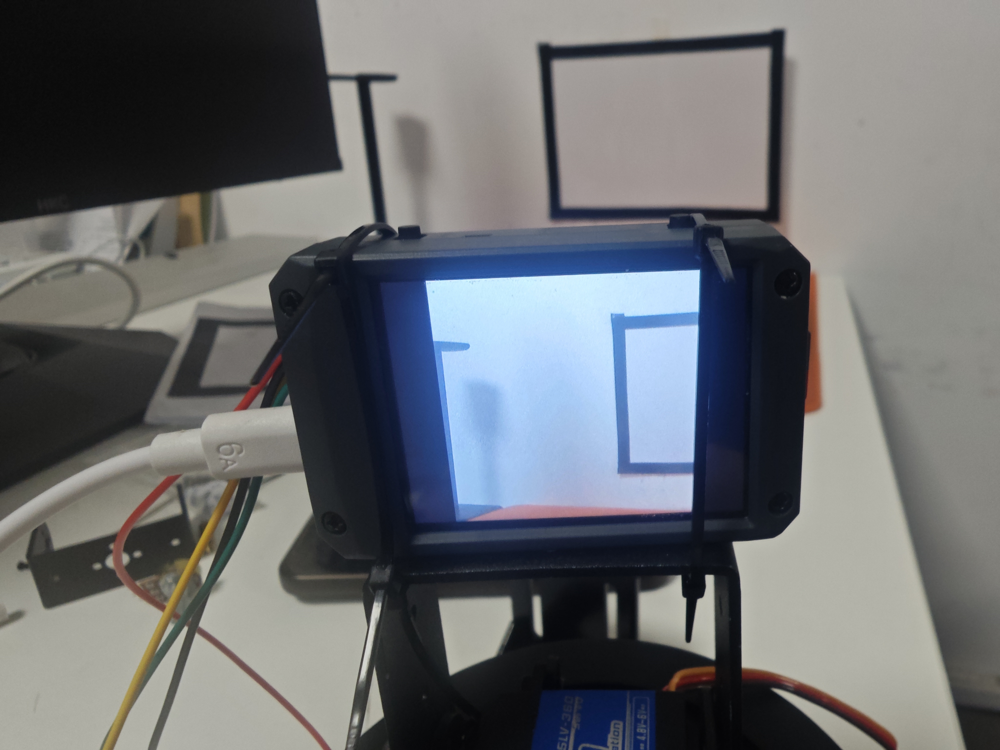
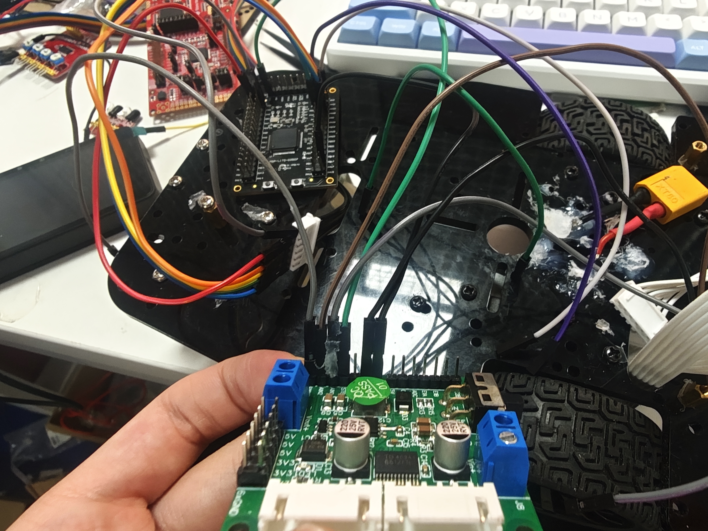

# 回忆“进化”历程（二）

## 当头一棒

现在回想起来，那时候对自己最准确的形容，大概就是：一个很能打的打手，但离工程师还差得远。对系统架构和文档开发的理解，几乎为零。

电赛虽然准备得不算充分，但前三题还是顺利做出来了。基础部分其实不难，问题在于当时一上来没有做闭环速度控制，再加上结构本身也有问题，小车在运输过程中受损，线直接断了，最后只能 `gg`。

  
  

测评出来的时候，我和队友一起瘫坐在台阶上。那种感觉到现在都还记得。

但失败这种东西，本来就会反复砸在人头上。虽然整个暑假都闷闷不乐，但也正是那股憋屈，逼着我继续往下学。

## 第二次进化：从开发到架构

后来我决定恶补 `HAL` 库。毕竟它更现代，我也开始意识到：对于陌生对象的开发来说，封装 `API` 和整理文档根本不是装饰品，而是门槛。

于是我系统学了一套韦东山的 `HAL + RTOS`。第一次真正理解到 `OS` 的力量时，我甚至有点想哭。工具链也在那段时间一路革新：从 `Keil`，到 `CubeMX + CubeIDE`，再到 `CubeMX + CMake + Ninja`。

也是在那时候，`agent` 开始出现，我也逐渐把它引进到开发流程里。看了无数开源硬件和项目之后，我才第一次真正明白，什么叫“工程”，也终于看清了过去很多活其实只是体力劳动披了一层技术外衣。

学会工程架构思维之后，我感觉自己像是换了一个人。新的工具链极大地解放了生产力；而 `agent` 介入之后，对底层 `API` 的统一管理，以及基于 `RTOS` 思想做上层解耦设计，都让我第一次真切地感叹：原来代码还可以这样写，而不是像以前那样一坨一坨地堆。

尽管底层的重复工作交给了 `agent`，但我反而比以前更累了。`Transformer` 架构下的 `LLM` 不是神。受限于上下文，它没法从零直接搓出一个完全符合规范、可维护，而且人还能继续调整设计的工程。谁要是真把它当全自动许愿机，最后多半只会产出一堆能跑但不能碰的垃圾。

我很快意识到，真正重要的是架构规则本身的设计。人虽然从重复劳动里解放出来了，但每天还是得负责架构层的规划，以及技术栈的理论学习。毕竟这些东西你要是不懂，`review` 代码就是装样子，`debug` 也只能靠运气。

那时候还没有“智能体”这个概念，很多事情依旧得自己肉身去编、去审。审核几千行 `C` 代码里的指针逻辑，现在回头看，不只是傻，简直像在拿命给低效流程填坑。

从 `ST` 到 `GD`，到 `AT`，再到 `STC`，我接触了很多 `MCU` 架构，也逐渐深入理解了 `ARM` 架构、总线、外设和寄存器。`LVGL` 的移植开发我虽然当时也才刚入门，但那会儿前端基本 `gg`，全权交给 `agent` 也已经够用了。再到 `RTOS` 的移植和内核，这些东西一起涌上来，生产力的解放就像洪水一样，把以往几年的知识迅速内化成了真正的成果。

那段时间，我就像野狗一样，没日没夜地狂吠。睡觉在当时，甚至成了我最讨厌的事情，因为一闭眼就像在给落后的自己续命。

不过反过来看，尽管那时候已经在做架构相关的事，本质上也还只是刚刚开智的阶段。别人未必做不到，只是很多人懒得往深处走，满足于把活干完就算结束。而我对技术的要求更高，也一直想逼自己去做那些别人不愿做、或者根本做不了的活。
