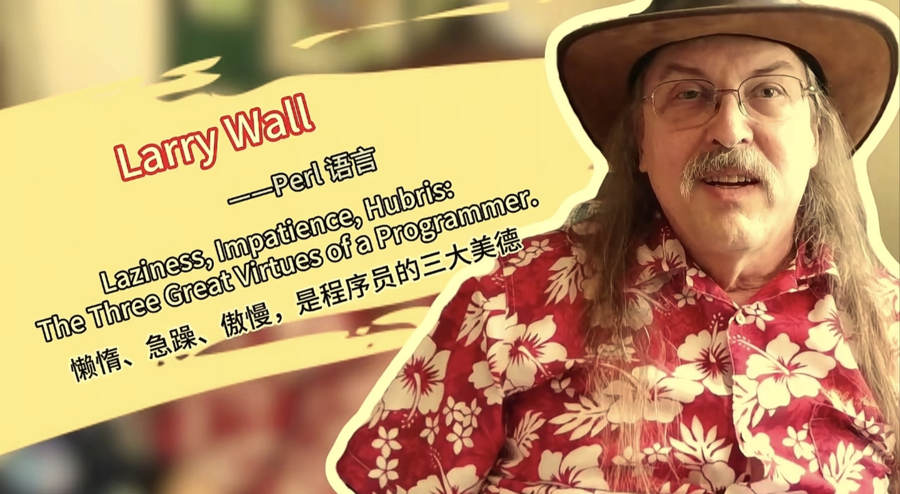
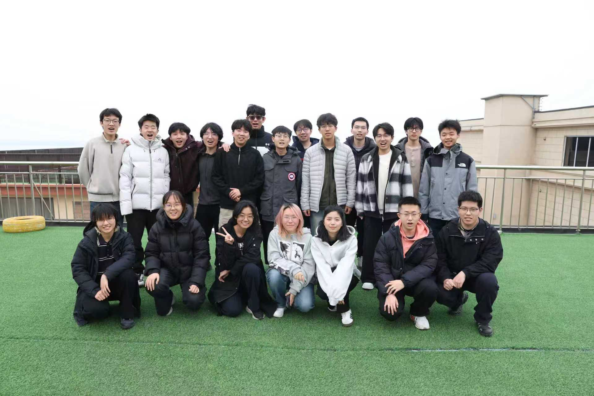
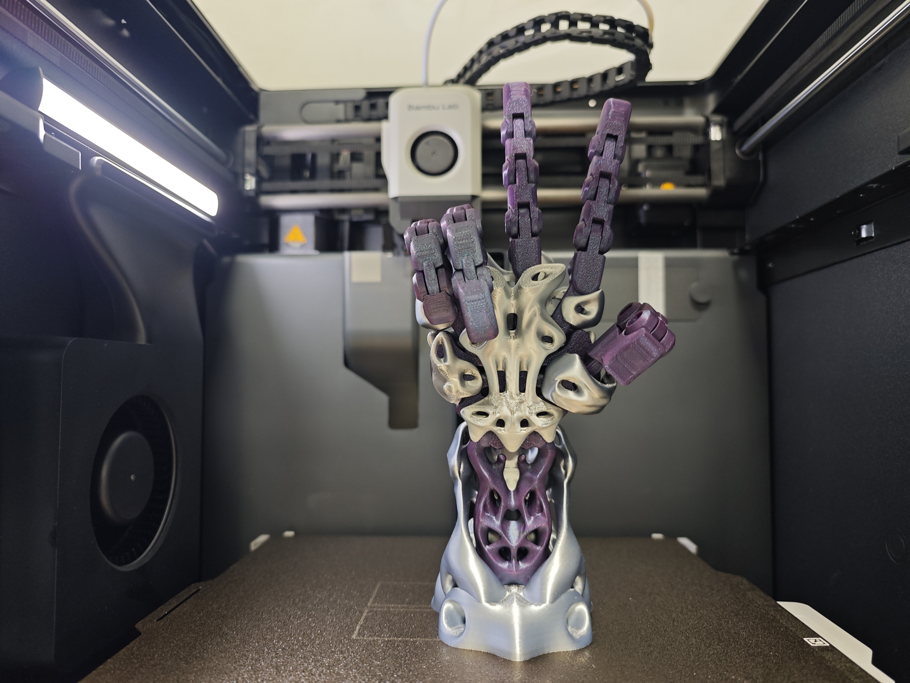
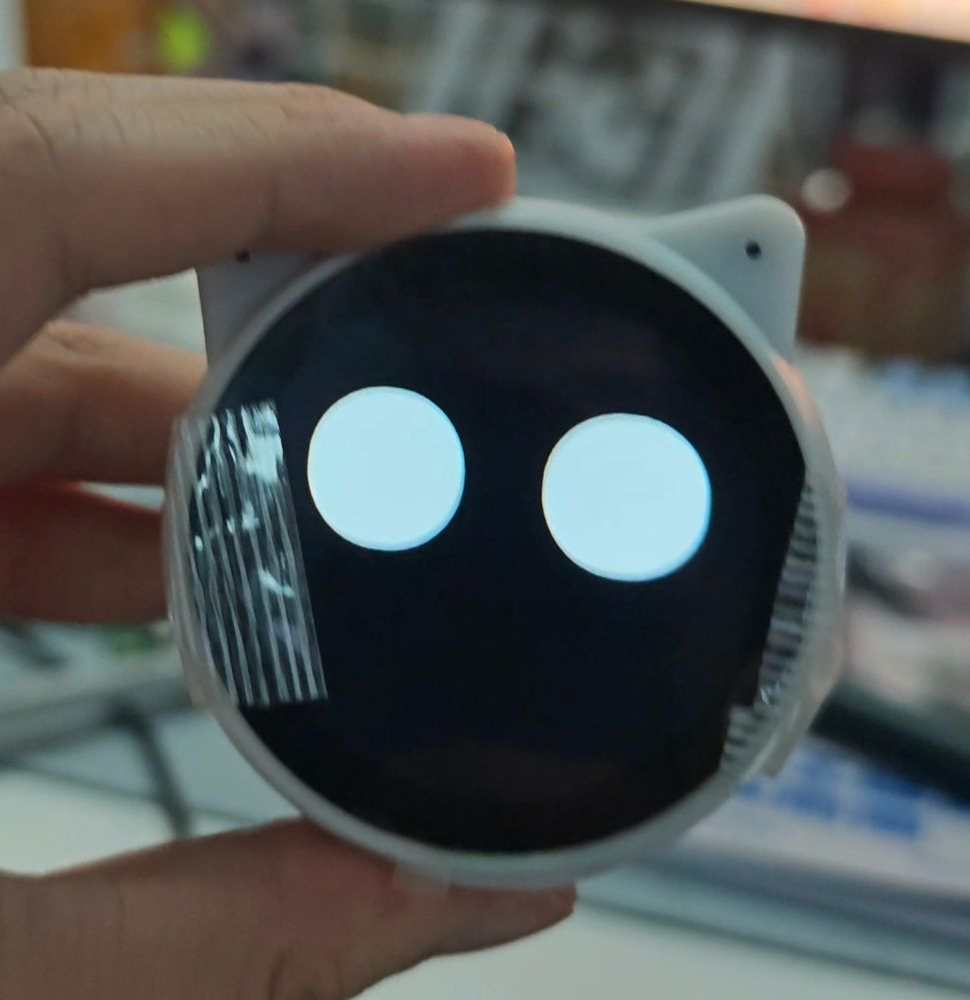

# 回忆“进化”历程（三）

## 思想转变

在工程里，我第一次真正找到了自我。`APP` 层的联合使用，让我感觉自己像是工程王国里的统治者，掌控着一整套规则。反过来，返校之后再去学课本上的东西，却只让我觉得恶心。那些理论知识没有任何反馈回路，学到的内容放进工程里，很多时候连路边的蚂蚁都不如，至少蚂蚁还真在干活。也是从那时起，我第一次那么清楚地感受到 `CN` 教育体系的问题。

我对成为“做题家”的厌恶，几乎压过了一切别的情绪。一想到还要和这些人去竞争所谓的高学历，心里就会生出强烈的反感，因为那套游戏本身就让我觉得廉价。

我会想起《第一滴血》里那句经典台词：“兰博，战争已经结束了。”是的，从高考结束之后，做题就不该再是人生唯一的目标了。去追求那些工程里根本用不上的成绩，在当时一心想成为工程师的我看来，无非就是把生命继续拿去喂一台根本不产出价值的机器。

对工程的狂热、对技术的野心，让我身上慢慢有了 `Larry Wall` 说的那种“傲慢”。但我到现在依旧觉得，这是对的。如果连这点技术认同感都没有，那我大概也坚持不到现在。说白了，我就是看不上那种明明没产出，却还要靠一套评价体系自我感动的东西。哈哈哈。

好在 `fpg` 里还有不少一样的兄弟。尽管大家方向不同，但在成长路上，至少还有搭档。

  
  

## 第三次进化：现代工程平台的架构开发与工作的成长

实验室初代目的学长毕业之后去公司当了 `CTO` 创业，正好缺少技术栈和我接近的人，于是对我发出了邀请。尽管我那时候还是在校生，我还是接下了这份兼职。

嵌入式架构、系统开发和硬件这些工作，让我第一次真正感受到了初创公司的魅力：有话语权，能做研发，而不是单纯去打工、做那种谁来都能替代的重复劳动。

`ESP32` 的开发就是工作核心内容之一。作为一个最不像 `CN IC` 厂商的公司，它用 `RISC-V`，做 `LTO`，用 `IDF` 开发，`CLI` 和 `VSC` 都支持。充足的文档和极其丰富的 `components`，让我第一次感受到了那种更接近计算机世界的生态，以及真正愉快的开发体验。和很多把开发环境做得像惩罚人的玩意儿相比，这才像是给人用的东西。

也是在这一阶段，`agent` 的介入逐渐成熟。长时间使用之后，我对这个时代里“人”到底该做什么，有了越来越清晰的认识。所有简单、重复的工作，都应该交给 `agent`，交给脚本，交给下手；而自己的精力，应该放在高层决策、需求对接和技术方案落地上。这才是别人做不到、只有我才能做的活。还把自己绑在低级重复劳动上，只能说明对工具没有理解，对自己也没有要求。

毕竟，我是从硬件底层这种“怪物牧场”里爬出来的人，民间高手云集；再加上建模科班出身，`3D` 打印和结构设计也给了我足够的信心和经验，让我能用一套模板去处理各种工程。哪怕遇到不会的点，智能体形成的闭环，很多时候也能把问题修回来。见过这种强度之后，再回头看很多自称“工程”的东西，真的会觉得太软、太慢，也太浅。

那种感觉就像魔法师一样，看着一个又一个工程从想法变成硬件，再变成软件；同时我又像是赛博牛马 `agent` 的老大，一个指令下去，`10+` 分钟到 `20+` 分钟，多线程一起干活。那种拥抱现代工具之后的便利和爽感，确实很难形容。尝过这个之后，再让我回去手搓那些低效流程，我只会觉得是在倒退。

  
  

## 小结

作为“著名本科进化论”提出者，我现在越来越觉得，进化不仅仅是技术上的长进，更是思维方式和工作流的彻底变化。拥抱现代、接受革新，多交流，别闭门造车，这些才是进化真正的关键。

哦对了，千万别继续在传统工具链里吃屎。能换就换，能升级就升级。点名 `FPGA`。

后续打算继续进阶自动化工具 `ROS` 和自己想做的小玩意吧。这一路心态也成熟了不少，无脑追求竞赛证明就跟追求绩点一样，下一次更新智能车的罪与罚。
