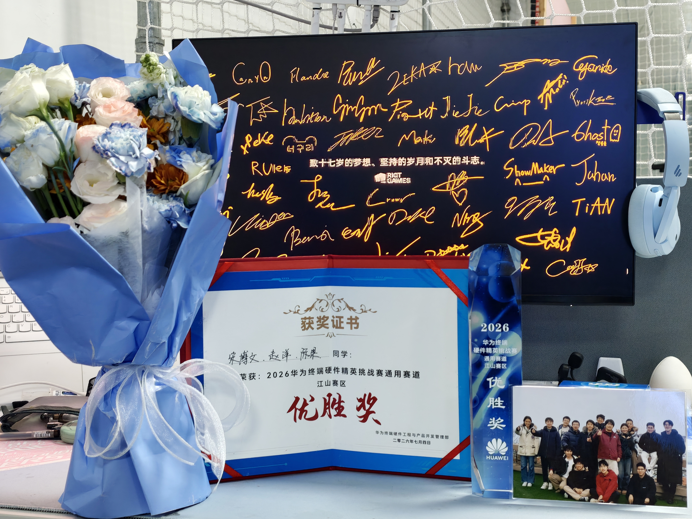
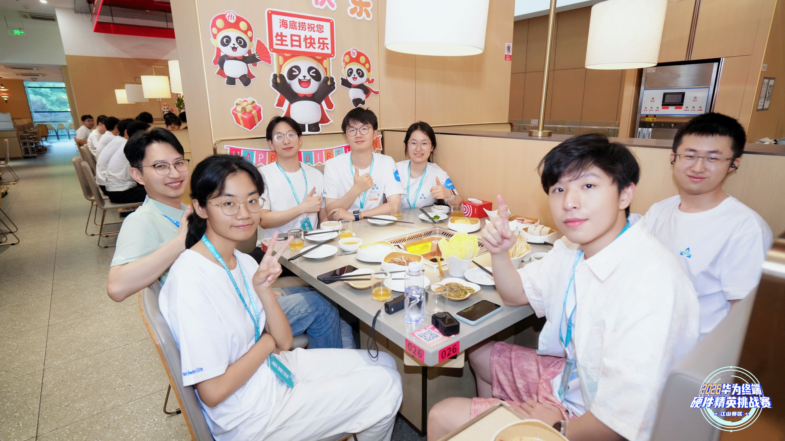

# 华为比赛复盘：差一点赶不上飞机，也差一点打得更好

  

回忆一下 `7.4` 的华为比赛。

事情从 `7.3` 晚上就开始离谱了。那天晚上十点半左右，我一度真以为自己要赶不上飞机了，结果突然发现航班延期到了第二天凌晨一点。只能说，还好还好。

本来想着到机场之后，或者上飞机之后，还能再复习一点比赛相关的东西。结果刚坐上去，整个人就被期末熬夜攒下来的疲惫直接击昏，进入昏迷模式。再醒过来的时候，已经快到南京机场了，时间差不多是凌晨两点半。

然后又出了一个很蠢的问题。

因为换了书包，我完全忘记自己昏迷前把机票和身份证塞到了哪里。下飞机之后翻了半天没找到，还以为落在飞机上了，于是在行李等候区硬等了一个小时。地勤都快劝我走了，结果我刚坐上网约车，就发现东西其实一直在书包的一个小口袋里。

只能说，人困到一定程度，智商是真的会掉线。

最后到酒店洗完澡，已经凌晨四点半了。睡了大概三个小时，第二天就直接去比赛。

## 比赛本身

这次华为比赛给我的第一感觉，是它比我预想中正式很多。

一开始我对这类企业比赛多少有点刻板印象，总觉得可能只是喊大学生来做点便宜方案，或者做一场偏宣传性质的活动。但实际体验下来，华为的硬件终端和赛题设计都挺认真，至少不是随便糊一个题目出来应付学生。

可惜最大的问题还是状态。

因为前面一直被期末周压着，我们其实没能充分准备。赛题整体围绕 `STM32F103` 开发，一个方向偏硬件，涉及激光雷达后端信号、运放和数据处理；另一个方向偏软件，主要是触控笔的无线充电和软件开发。

我们比较不幸，抽到了第一个方向。

现场十六强队伍水平都还可以，基本是 `211`、`985` 的研究生，甚至还有博士生，不少人还是 `DSP`、电机控制相关方向的。这个阵容放在那里，压力还是很明显的。

## 现场做题

第一问是恢复高电压输出。

本质上其实就是 `EN` 没开。那个 `Boost` 电路做得挺厉害，可以从 `5.5V` 升到 `85V` 左右，高压输出恢复得还算轻松。

但后面的串口打印 `ADC` 数据就开始卡了。

一方面是 `CubeIDE` 用得确实不多，临场切环境本来就不顺手；另一方面是 `HAL` 库的字节发送接口更偏 `8bit` 数据，而 `ADC` 返回的是 `32` 位结构。怎么把数据正确转换、组织、发送出去，我们现场试了几种方式都没完全打通。

这部分确实有点难受。

第二问是实现高压输出电压调节。

这个相对简单，用 `PWM` 模拟 `DAC`，影响反馈端 `FB`，进而调节高压输出，基本就能解决。中间还被高压电了两下，倒不是特别疼，但确实有点麻。只能说，做这种题还是要对硬件保持敬畏。

第三问是信号运放问题，要求调整输入输出，让波形尽量不失真。

这部分更能感受到课本知识和现场工程之间的差距。课本上学过运放，知道一些基本概念，但真正到了现场，要根据实际信号、实际电路、实际现象去调整，完全是另一回事。这一方面感觉还是得学一下。我们的方向其实已经找对了，只是时间不够，没能把结果继续往前推。

赛后先是下午茶和领取纪念品,之后是答辩,晚饭去园区的海底捞狠狠猪了一把,一桌900额度也可以说是吃到爽哈哈哈。

  

## 结果和复盘

整体来说，这次题目不算特别离谱，甚至可以说没有想象中那么难。但因为备赛、环境、状态这些问题叠在一起，最后结果不算理想。

说白了，还是菜。

不过没想到的是，这样最后还能拿到第六名。算下来，这应该是我目前技术比赛里拿到的最高奖项了。短时间、高压力、现场出问题的比赛，确实最能看出一个人的综合水平：基础够不够扎实，环境熟不熟，状态扛不扛得住，临场判断稳不稳，全都会暴露出来。

这次喜提 `2k`，虽然其中 `1k` 直接变成了机票钱，但至少没给实验室丢脸。

另外也认识了一些 `HR`，聊下来能感觉到他们确实很懂就业，也能从企业视角看到很多学生平时不太会注意的东西。这部分收获也挺重要。

总的来说，这次比赛有遗憾，但也有价值。

遗憾是明明可以打得更好，价值是它把很多短板直接摆到了面前：准备不够、工具链不够熟、临场状态不够好，对硬件题的处理经验也还不够。

就这样。

来年必须干回来。
