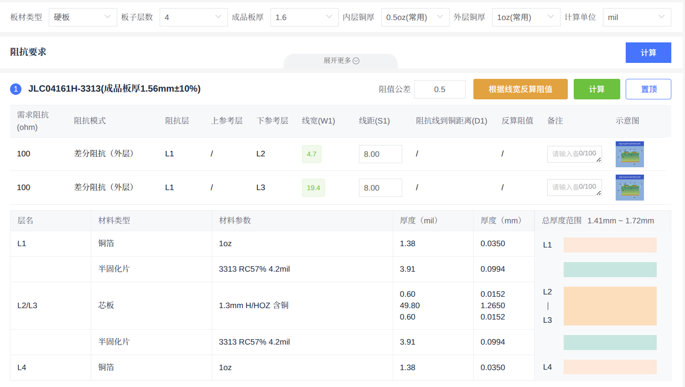
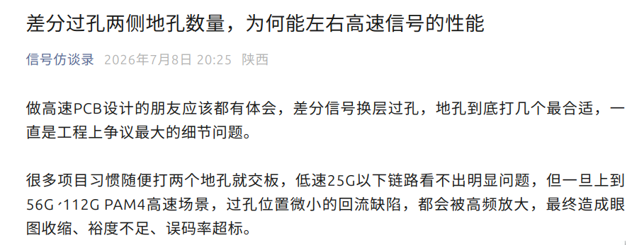
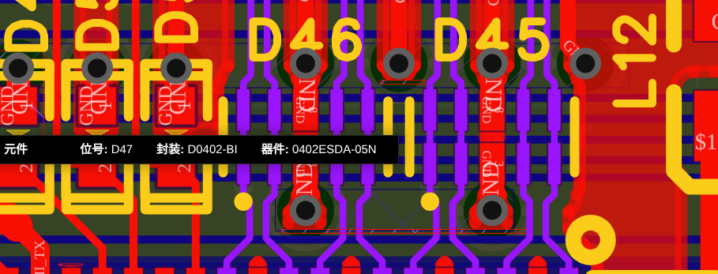

# 高速 PCB 设计入门（一）：从阻抗、叠层到回流路径

最近接到的工作，是给 `CM4` 画一块载板。以太网、HDMI、USB 3.0、CSI 这些接口都要从 SoC 引出来；另一边，自己做 ESP 板子时也第一次没有直接使用模块，而是自己布局并处理 `2.4 GHz` 天线。

这两件事放在一起，刚好把我之前零散接触过的知识串起来了：单端阻抗、差分阻抗、叠层、参考平面、回流路径，以及高速线换层时那些很容易被忽略的小细节。

硬件设计里的知识很像魂类游戏。你需要先记住一套通用动作，例如怎样选叠层、怎样约束线宽线距、怎样让回流路径连续；但真的遇到 HDMI、USB、以太网或天线时，又得回到各自的数据手册和参考设计，重新看它们的出招。

所以打算开一个小系列。这一篇先记下高速 PCB 的通用基本功，后面再按接口逐个整理。

## 阻抗到底是什么

高速信号里的阻抗，不能简单理解成万用表量到的电阻。对于一根走线来说，它更接近信号沿着走线传播时看到的特性阻抗，和线宽、铜厚、介质厚度、介电常数、附近铜皮以及最重要的参考平面都有关系。

当信号边沿足够快时，走线就不再只是“把 A 接到 B”的一段铜，而是一段传输线。阻抗突然变化，部分能量就会反射回来；反射叠加到原信号上，轻则让波形变差，重则影响眼图、时序裕量和链路稳定性。

常见的目标值大致有这些：

- 单端线常见为 `50 ohm`；
- 差分线常见为 `90 ohm` 或 `100 ohm`；
- HDMI、USB、以太网、MIPI/CSI 等接口的具体目标值并不完全相同，最终还是以芯片数据手册、连接器和参考设计为准。

这里还有一个容易混淆的点：**受控阻抗**和**端接匹配**不是一回事。前者主要通过叠层和几何尺寸，让走线本身做成目标阻抗；后者则可能涉及串联、并联或 AC 端接电阻。PCB 先把走线环境做对，后面的端接才有讨论的基础。

## 叠层和参考平面：阻抗从这里开始

画高速线之前，先看板厂给出的叠层。不要先凭经验定一个线宽，再去问板厂能不能做；同样是 `50 ohm` 单端或 `100 ohm` 差分，在不同板厚、不同介质和不同参考层距离下，尺寸可能差得非常多。

比如嘉立创 `3313` 四层板的一个计算结果中，同样在外层 L1 走 `100 ohm` 差分线、线距保持 `8 mil`，参考 L2 时线宽约为 `4.7 mil`；参考层换成更远的 L3 后，线宽会变成约 `19.4 mil`。这不是一个可以忽略的小改动，而是参考平面距离改变后，走线电场分布随之改变的直接结果。

  

这里的“参考地”并不是说整层必须从边到边全部铺满铜。对一根高速信号线而言，只要它相邻的一层、尤其是正下方，沿着整段走线路径都有连续的 GND 铜皮，并且这片铜皮足够宽、没有被槽孔、分割或大面积挖空切断，它就可以作为这根线的参考地。高频回流电流会尽量在信号线正下方、靠近信号投影的位置返回；因此真正要保证的是这条回流走廊连续，而不是为了“满铜”把整层所有空白都塞上铜。

把一整层做成完整地平面，仍然是最容易判断、最不容易出错的做法：它能给多组信号提供稳定的回流路径，也能减少布局变化带来的意外。但局部连续的 GND 区同样可以成为有效参考，只要信号始终没有跨过它的边缘、缝隙或分割。反过来，即使某一层大部分都是地，只要高速线刚好从地平面的缺口、不同电源岛之间或狭窄地颈上方经过，回流路径仍然会被破坏。

所以，高速线最理想的状态是：沿着完整、连续的参考地走线。参考地不仅帮助决定阻抗，也提供高频回流电流最短、最低电感的路径。需要注意的是，同层随手加的一小块 GND 铜皮不一定能替代相邻参考平面；它是否有连续回地、距离是否合适、会不会改变阻抗，都需要单独判断。跨过分割平面、悬空区域或突然改变参考层，都会让回流路径变得不连续。

在正式布线前，我现在会先做三件事：向板厂确认叠层和阻抗能力；根据目标阻抗得到线宽、线距和铜厚约束；再给不同接口预留足够的走线层和参考层。这样比后面满板改线轻松得多。

## 换层时，别忘了给回流电流找路

高速线避不开换层。过孔会带来寄生电感、电容和阻抗突变，但更容易漏掉的问题是：信号换层后，它的参考平面可能也变了。

高频回流电流不会随便绕很远去找地，它会尽量贴着信号线下方或附近的参考平面返回。假如信号从参考 L2 的一层切到参考 L3 的一层，回流电流同样需要从 L2 转移到 L3。这个位置如果没有合适的地过孔，回流就会被迫绕路，环路面积变大，辐射、串扰和阻抗突变都会更明显。

所以在高速信号换层的附近，通常需要放置连接相关参考平面的 GND 过孔，常被称为**回流过孔**或 **stitching via**。它不是“地过孔越多越好”的装饰，而是给高频回流提供一条短而连续的跨层通道。

  

对常见速率的接口，这个细节未必会立刻让板子失效；但速率提高、裕量变小之后，原本不起眼的回流缺口就可能被放大。换层尽量少、参考层尽量连续、需要换层时把回流过孔放近，这几个原则基本不会错。更高带宽下的具体过孔数量、间距和焊盘反焊盘尺寸，则需要结合叠层、仿真和参考设计确定。

## 等长和串扰：不是把线绕长就结束了

等长是高速接口中最容易被看见、也最容易被机械执行的一条规则。差分对中的两根线需要控制长度差，是为了让两路信号尽可能同时到达；并行总线或同一组数据线之间，也可能有组内时序要求。

但等长应该服务于具体接口的时序预算，而不是看到高速线就全部绕成蛇形。蛇形补偿本身会带来额外耦合，补得太远、太密，反而可能增加不必要的串扰。我的理解是：**哪里短，就在离短处不远的位置补；能直走就别为了好看绕路；先满足接口规则，再谈整齐。**

串扰也是同样的思路。两根高速线靠得太近、并行走得太久，电场和磁场耦合就会让一根线的变化影响另一根线。常说的 `3W` 原则可以作为起点，即相邻线之间尽量留出不小于三倍线宽的距离；但它不是万能公式，真正的耦合还和叠层、平行长度、信号边沿、参考平面以及是否差分走线有关。

SoC 或连接器的高速引出区域尤其拥挤。像 HDMI、USB 等差分对从密集引脚扇出时，两个高速信号之间经常会安排 GND 焊盘、地保护线，并用密集的地过孔把它们缝到参考平面。这种做法常被叫作**地过孔栅栏**（ground via fence）或**地过孔缝合**（via stitching）；如果引脚排列本身是地-信号-地，则也可以称为 `GSG`（Ground-Signal-Ground）布局。

  

它的核心不是单纯“塞很多 GND”，而是隔离相邻信号、约束电磁场，并让回流路径更明确。当然，地过孔和保护铜也不能贴得毫无节制，离高速线太近同样会改变阻抗。先按接口参考设计布，再根据板厂规则和空间做调整，通常比凭感觉加铜更可靠。

## 阻抗控制区别随手整块铺铜

这条不只和天线有关。只要一根线做了阻抗控制，它的线宽、线距、与参考地的距离，以及同层附近有没有铜，都是同一个模型里的条件。前面算出一组线宽和线距，默认的是某个确定的叠层与周边环境；之后再往走线两侧、下方或扇出区域随手补一大块铜，等于又改了一次模型。

尤其是同层靠近受控阻抗线的铺铜，会改变走线周围的电场分布和等效电容，走线可能从原本的微带线变成带共面地的结构，阻抗自然也会跟着变化。零散的小铜皮、细长铜条和形状不规则的补铜同样不能只当成“剩下的一点铜”看待：它们的位置、尺寸和边缘都会参与高频电磁场；即使通过很多地过孔接到了地，也不代表对阻抗和串扰没有影响。

这不是说整板不能铺地。用于信号下方的连续参考地需要保留；如果设计一开始就按共面地或 GND guard 的结构计算，附近的地铜也可以存在。重点是：**铺铜必须先进入阻抗模型和布线规则，不能在走线完成后为了看起来完整而随手补。** 对于需要阻抗补偿的区域，应先设好与铜皮的间距、禁布/禁铜区和过孔规则，再统一执行。天线会对这类变化更敏感，但它只是最容易暴露问题的一个例子，不是这条规则的前提。

写到这里才发现，高速 PCB 真不是背几条规则就能直接套进去的东西。叠层、参考地、过孔、铺铜和线长，单独看都很好理解；但它们一旦挤在同一块板子上，就会互相影响。很多时候问题也不是“不知道规则”，而是画板时为了腾位置改了一处，后面才发现参考地、阻抗或者回流路径已经跟着变了。

这次画 `CM4` 载板和 ESP 板子，算是把这些原本零散的概念真正碰到了一遍。后面遇到 HDMI、USB、以太网和 MIPI，再把具体的布局过程和踩到的坑继续记下来。到时候再回头看，应该会比现在这篇更有东西。
