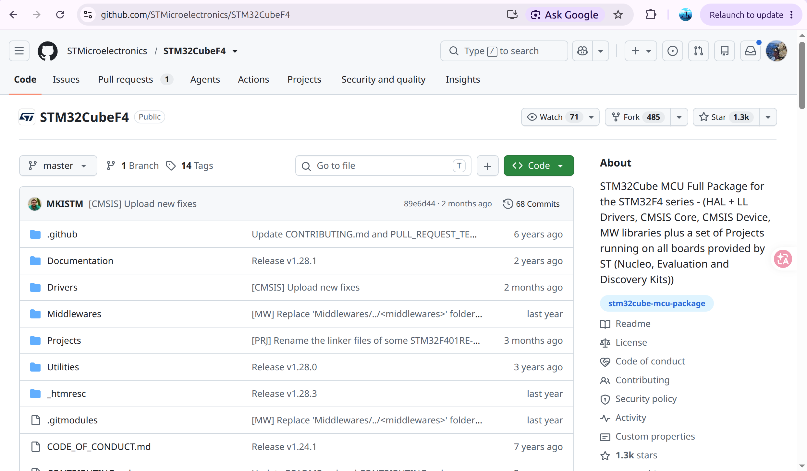
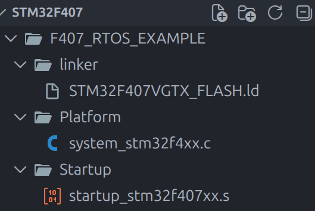
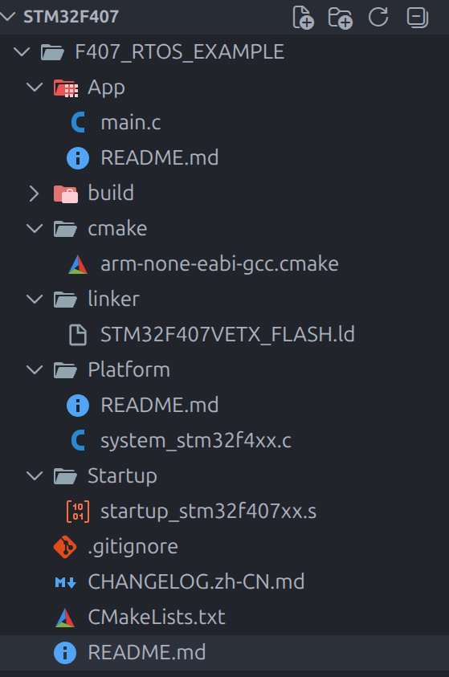

# RTOS 前传：先把 STM32F407 的编译黑盒拆了

之前其实学过 `RTOS`，但那时候纯纯把它当黑盒来用：会创建任务、会调度，能跑起来就完事了。`CMake` 也差不多，自己甚至没怎么手写过。

我发现自己每次开学，工程能力都会 `++`；每次一放长假，又会再进化一次。原因可能也很简单：假期里有时间把那些最基础、最底层的东西重新磨一遍。刀磨了一整个假期，开学当然砍得更快。

所以接下来准备更新一个新篇章，重新学 `RTOS`。这次以 `STM32F407VET6` 为例，不急着上操作系统，先从最基础的工程开始：补齐启动文件、系统初始化文件和链接脚本，再亲手写好 `CMake`，让它真的编译起来。

这一篇就是前传。看懂它最好有一点汇编语言和微机原理基础，不然中间可能会有点吃力。

> 本系列均使用编辑器 + CLI，拒绝一切丑陋的 IDE，比如 Keil CubeMX。用 Keil 的你一辈子没法成长 ,就等着找底薪工作吧。

## 先把官方仓库拉下来

先克隆 ST 官方的 [STM32CubeF4](https://github.com/STMicroelectronics/STM32CubeF4) 仓库。里面有一堆库、驱动和例程，也有我们需要的启动文件。



这个仓库其实挺大，只想拿来搭工程的话，浅克隆就够了：

```bash
gh repo clone STMicroelectronics/STM32CubeF4 -- --depth 1 --recursive
```

相比完整克隆，体积能小一半以上，快多了。没必要为了三个文件把整个 Git 历史请回家供着。

接下来把工具配齐：

- `arm-none-eabi-gcc`
- `gdb-multiarch`
- `cmake`
- `ninja`
- `openocd`

我自己都安装过了，这里就不演示了。

## 一个最小工程需要什么

先从 CubeF4 里复制三个关键文件：

```text
F407_RTOS_EXAMPLE/
├── Startup/startup_stm32f407xx.s
├── Platform/system_stm32f4xx.c
└── linker/STM32F407VETX_FLASH.ld
```

官方仓库里比较容易找到的是 `STM32F407VGTX_FLASH.ld`。它也能拿来改，但一定要注意：`F407VGT6` 有 `1 MB Flash`，这里使用的 `F407VET6` 只有 `512 KB Flash`。复制之后要把链接脚本改对，最好顺手重命名，免得哪天把自己也骗了。

最基础的文件结构大概这样：



这几个文件到底是干啥的？这就要从编译开始说了。之前说用 IDE 的永远不会成长，原因就在这里：一点 `Build`，后面的东西全黑了。你只知道没报错，牛逼，可以烧录；或者突然蹦出一个 `error`，卧槽，牛魔的，快修改。

但我们写的一堆 `.c`、`.h`，到底是怎么变成 MCU 能执行的机器码的？大致流程其实就这一条：

```text
C / 汇编源码
    ↓ 编译、汇编
.o 目标文件
    ↓ 链接脚本安排地址
ELF
    ↓ objcopy
BIN / HEX
    ↓ OpenOCD
STM32 Flash
```

## `arm-none-eabi` 这一家子

先简单认一下工具链，后面报错时至少知道该骂谁：

| 工具                      | 作用                                 |
| ------------------------- | ------------------------------------ |
| `arm-none-eabi-gcc`     | 编译 C，也可以统一调用汇编器和链接器 |
| `arm-none-eabi-as`      | 把汇编代码变成`.o`                 |
| `arm-none-eabi-ld`      | 把一堆`.o` 链接成 ELF              |
| `arm-none-eabi-objcopy` | 把 ELF 转成 BIN 或 HEX               |
| `arm-none-eabi-objdump` | 看段信息和反汇编                     |
| `arm-none-eabi-nm`      | 看符号和地址                         |
| `arm-none-eabi-size`    | 看 Flash 和 RAM 占用                 |
| `arm-none-eabi-gdb`     | 调试正在运行的程序                   |

`arm-none-eabi` 也不是什么神秘咒语：

```text
arm   → 目标架构是 ARM
none  → 不针对某个操作系统
eabi  → 使用嵌入式应用二进制接口
```

至于 MCU 是哪个内核，则由编译参数告诉 GCC，比如 F407 是 `Cortex-M4`，F1 常见型号是 `Cortex-M3`。`-mcpu=cortex-m4 -mthumb` 这类参数就该出现在工具链或 CMake 配置里。

真正决定“代码放到 Flash 哪儿、变量放到哪块 RAM”的，是下面这个文件。

## 1. 链接脚本：告诉链接器这个家有多大

文件：`linker/STM32F407VETX_FLASH.ld`

链接脚本干的事很直接：

> 老子是什么型号？RAM、Flash 多大？每一段程序到底放哪里？

首先是程序入口：

```ld
ENTRY(Reset_Handler)
```

这表示固件的入口符号是启动文件里的 `Reset_Handler`。

然后计算栈顶：

```ld
_estack = ORIGIN(RAM) + LENGTH(RAM);
```

再描述物理内存。以 `STM32F407VET6` 为例：

```ld
MEMORY
{
  CCMRAM (xrw) : ORIGIN = 0x10000000, LENGTH = 64K
  RAM    (xrw) : ORIGIN = 0x20000000, LENGTH = 128K
  FLASH  (rx)  : ORIGIN = 0x08000000, LENGTH = 512K
}
```

这里必须和手上的芯片对得上。写小一点一般只是浪费空间，写大了却可能把程序链接到根本不存在的 Flash 里，到时候就不是“为什么没亮”这么温柔了。

所以 IDE 里选择芯片型号，不只是让界面左上角多一串字；它背后也在替你选启动文件、链接脚本和编译参数。IDE 帮你做了不代表这些东西不存在，只是以前它们被藏起来了。

一句话总结：`arm-none-eabi-ld` 负责链接，`.ld` 负责告诉它怎样安排 STM32 的内存。

## 2. `startup_stm32f407xx.s`：上电后第一棒

第二个关键文件是：`Startup/startup_stm32f407xx.s`。

它有两重身份。构建时，它先被汇编成目标文件，再和 `main.o`、`system_stm32f4xx.o` 一起链接：

```text
startup_stm32f407xx.s
        ↓ 汇编
startup_stm32f407xx.o
        ↓ 和其他 .o 一起链接
app.elf
        ↓ 烧录
STM32 Flash
```

它主要贡献几块内容：

```text
.isr_vector            中断向量表
.text.Reset_Handler    复位启动代码
.text.Default_Handler  默认中断处理代码
```

链接器再根据 `.ld` 文件，把向量表和代码放进 Flash。

不过，CPU 并不是从 `.s` 文件第一行开始往下读。像 `.syntax`、`.cpu`、`.section`、`.word` 这些，大多是给汇编器看的指令或者数据，不是 CPU 上电后逐句执行的代码。

假设 `BOOT0 = 0`，芯片从内部 Flash 启动，硬件会先读取向量表前两项：

```text
0x08000000 的 32 位数 → 装进 MSP，成为初始栈顶
0x08000004 的 32 位数 → 装进 PC，跳到复位入口
```

对应到启动文件里就是：

```asm
g_pfnVectors:
    .word _estack
    .word Reset_Handler
```

于是整个过程变成：

```text
上电 / 复位
    ↓
CPU 读取 _estack
    ↓
CPU 读取 Reset_Handler 地址
    ↓
跳进 Reset_Handler
    ↓
SystemInit → 初始化 .data/.bss → main
```

所以更准确的说法不是“CPU 从 startup 第一行开始执行”，而是：

> CPU 根据 startup 生成的向量表找到 `Reset_Handler`，再开始执行它生成的复位代码。

到这里，`.s` 文件也没那么吓人了。它本质上就是在 C 世界开门之前，先把栈、内存和入口准备好。

## 3. `system_stm32f4xx.c`：终于回到舒适区

最后一个关键文件是 `Platform/system_stm32f4xx.c`。唯一一个 `.c`，是不是瞬间亲切多了？

这个文件来自 CMSIS，处在 startup 和 `main()` 之间：

```text
Reset_Handler
     ↓
SystemInit()       ← system_stm32f4xx.c
     ↓
初始化 .data/.bss
     ↓
main()
```

启动文件里会调用：

```asm
bl SystemInit
```

但 `startup.o` 自己没有这个函数。链接时，`ld` 会去 `system_stm32f4xx.o` 里把同名符号找出来。之前那一大家子工具到这里终于串上了。

这个文件里最值得先认识的是三个东西：

```c
void SystemInit(void);
void SystemCoreClockUpdate(void);
uint32_t SystemCoreClock;
```

### `SystemInit()`

它会在复位后、进入 `main()` 前运行，主要负责把 RCC 恢复到一个确定的基础状态、打开 HSI、处理 FPU 访问权限，以及按配置设置向量表或外部存储器。

它一般不会替你完成这些事：

- 配置最终的 168 MHz 主频
- 初始化 GPIO 和串口
- 初始化 HAL
- 初始化 FreeRTOS

这些还是后面的板级初始化代码来干。

这时候就有看到这里的吴彦祖、彭于晏困惑了：我不是已经在 CubeMX 的时钟树里把主频改成 168 MHz 了吗，怎么这里还是 16 MHz？

因为 CubeMX 生成的时钟配置，是进入后续初始化阶段才执行的。`SystemInit()` 只是先把芯片送回一个大家都认识的起点，然后你的代码再去开 HSE、配 PLL、切系统时钟。

### `SystemCoreClock`

```c
uint32_t SystemCoreClock = 16000000;
```

它只是一个记录当前 HCLK 的软件变量，很多地方会拿它计算 `SysTick`、RTOS Tick、串口波特率和定时器参数。

注意，它不是许愿池。你直接写：

```c
SystemCoreClock = 168000000;
```

并不会让 MCU 原地超频到 168 MHz，只会让软件以为它已经到了。真正的时钟还是得改 RCC 寄存器，然后调用 `SystemCoreClockUpdate()` 重新读取并计算。

### `HSE_VALUE`

`HSE_VALUE` 表示软件认为外部晶振是多少 Hz：

```c
#ifndef HSE_VALUE
#define HSE_VALUE 25000000U
#endif
```

这不代表程序已经启用了 25 MHz HSE，更不代表你板子上真的焊了 25 MHz 晶振。板子是 8 MHz，就应该通过编译宏传入正确的值：

```cmake
target_compile_definitions(app PRIVATE HSE_VALUE=8000000U)
```

要不然硬件跑它的，软件算软件的，最后两边各过各的。

还有一个容易漏掉的点：这份启动文件会在 `.data` 复制和 `.bss` 清零之前调用 `SystemInit()`。所以它不能随便依赖已经初始化好的普通全局变量、堆或者完整的 C 运行库，主要还是直接操作硬件寄存器。

一句话总结：

> startup 负责把 C 程序的运行环境搭起来，`system_stm32f4xx.c` 负责把 Cortex-M4 和 STM32F4 拉回一个确定的基础状态，后面的 Platform 代码再配置这块板真正需要的时钟和外设。

## 最后交给 CMake

必备文件当然还有 `main.c`，这我就懒得说了。剩下主要是两个和 CMake 有关的文件：

```text
arm-none-eabi-gcc.cmake   # 指定交叉编译工具链和 CPU 参数
CMakeLists.txt            # 描述源文件、头文件、链接脚本和产物
```

工具链文件告诉 CMake 去哪里找 `arm-none-eabi-gcc`，目标是 `Cortex-M4`，要使用什么浮点 ABI；`CMakeLists.txt` 再把 startup、system、main 和链接脚本串起来，最后顺手生成 `.elf`、`.bin`、`.hex`。

具体 CMake 我这里就不展开了。了解基本逻辑之后完全可以让 AI 写，再自己检查参数和路径。这里还要顺便吐槽一下 py：这种东西简单到极致，有啥难度，用的时候学就行了，我完全不知道刻意学习的意义在哪里。

写好之后，工程结构如下：



然后：

```bash
cmake -S . -B build -G Ninja
cmake --build build
```

哦也，能编译了。

恭喜你亲手拆开了 IDE 的编译黑盒。下一步再往里面塞 `RTOS`，至少这次知道它到底站在什么东西上面了。牛逼吧。
