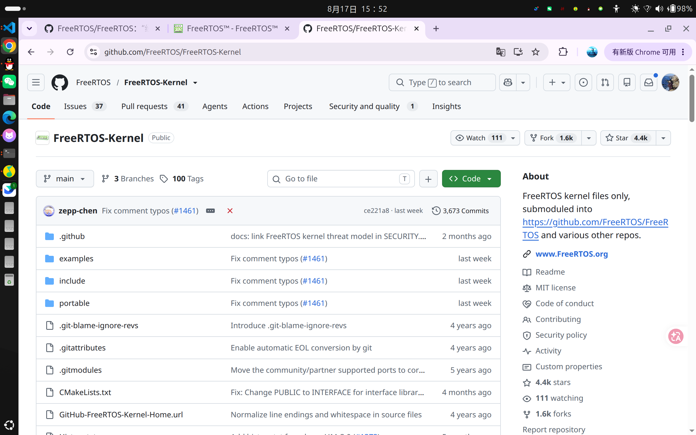
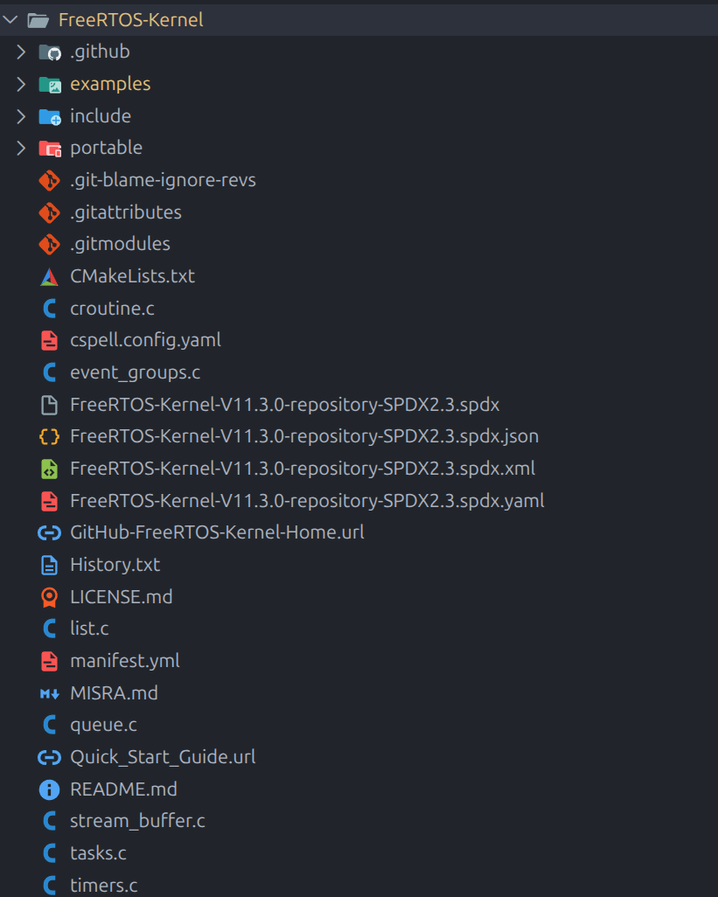

# RTOS 正传（一）：FreeRTOS 的目录、移植层和配置文件

上一篇把启动文件、链接脚本和 CMake 都搭好了，这一篇就是正传，开始把 FreeRTOS 搬进来。

学习 RTOS，注重适配层而不是内核，这一点很关键。这种大型开源项目，本来就是一个组织、一群人在维护，想把里面所有东西全部理解，本身就很困难。

当然，这不是说你不能成为贡献者。真想走这条路，也可以学阿酥在 Coding 那样一路混到大厂 Offer。但如果眼前只是想把 F407 上的系统跑起来，那就先把下面几个问题弄明白：

- 哪些 FreeRTOS 文件要编进工程？
- F407 + GCC 应该选哪个端口？
- 堆实现到底选哪个？
- `FreeRTOSConfig.h` 里一大堆宏，哪些真的要管？
- 哪些中断可以调用 `xxxFromISR()`？

这些问题先弄明白，系统就不再是“复制一个 Demo，能亮就算成功”的黑盒。

## RTOS 到底适合什么场景

我们接下来就依照 FreeRTOS 来介绍。OS 本质上就是调度器，就是多任务处理，所以它明显更适合业务逻辑复杂、控制频率没到 us 级的场景，比如智能穿戴和飞控。

没错，我这里把飞控也算作低频率控制系统。一是因为它的数据处理很复杂，二是因为电调本身的控制频率也不高，PX4 就是跑在 NuttX 上的。

但你说我搞高精度伺服、工业电机驱动，上个 RTOS，这就不符合应用场景了。这是很关键的问题。

## 先把内核仓库拉下来

这次直接看官方的 [FreeRTOS-Kernel](https://github.com/FreeRTOS/FreeRTOS-Kernel) 仓库。它只放内核源码、头文件和各种 CPU/编译器端口，比把 FreeRTOS-Plus、TCP、MQTT 全带上的聚合仓库清爽得多。



只学习当前版本的话，浅克隆就够了：

```bash
git clone --depth 1 --branch V11.3.0 \
  https://github.com/FreeRTOS/FreeRTOS-Kernel.git
```

官方文档在 [www.freertos.org](https://www.freertos.org/)。内容肯定最全，但第一次打开确实像面对一本全英文词典：每个 API 都能查，问题是根本不知道应该先查哪个。


我还是那个观点，没有什么比上手更重要。应用本来就比原理简单，设计岗薪资更高这一点事实足以佐证。所以这篇不准备逐行做源码解析，只介绍文件作用、怎么裁剪，以及核心移植层是怎么做的。源码主要还得靠自己慢慢啃，工程先跑起来再说。

## 克隆下来为什么这么吓人



点开目录第一眼确实容易晕：一个 `tasks.c` 就有 8872 行，旁边还躺着一堆不认识的配置文件。别慌，真正要烧进 F407 的内容并没有这么多。

这个仓库里的东西大致分成四类：

1. `tasks.c`、`queue.c`、`list.c` 这些通用内核源码；
2. `portable/` 下面针对不同 CPU 和编译器准备的移植代码；
3. `include/` 里的公共 API 和内核头文件；
4. GitHub、合规、发布和文档文件。

后面不再给每个文件单独截一张图了。最好把仓库放在旁边，对着目录往下看，会比只看文章顺得多。

## 先分清自己站在哪一层

这里最关键的不是记文件名，而是先搞清楚自己现在扮演什么角色。

**应用开发者**主要使用 `task.h`、`queue.h`、`semphr.h` 这些 API，再根据业务配置 `FreeRTOSConfig.h`。任务怎么分、栈给多少、优先级怎么排，这些才是日常工作。

**移植者**要把内核接到具体 CPU 和工具链上。F407 已经有官方 ARM_CM4F 端口，我们只需要选对、编进来，再接好 SysTick、PendSV、SVC 和中断优先级，不用自己从零写上下文切换。

**内核维护者**才需要深挖 `tasks.c`、`queue.c`、`list.c`，研究就绪链表、阻塞链表、优先级继承和调度细节。

还有一类是**仓库维护者**。`.github/`、MISRA、SPDX、拼写检查这些文件主要服务于 FreeRTOS 项目本身。它们不是垃圾，只是不会进入我们的固件。

## 顶层目录先过一遍

把截图里的内容整理一下，大概就是这样：

```text
FreeRTOS-Kernel/
├── .github/                 # CI、Issue/PR 模板、贡献规范
├── examples/                # CMake 示例和配置模板
├── include/                 # 内核头文件
├── portable/                # CPU、编译器和堆的移植实现
├── tasks.c                  # 任务和调度器
├── queue.c                  # 队列、信号量、互斥锁
├── list.c                   # 内核链表
├── timers.c                 # 软件定时器
├── event_groups.c           # 事件组
├── stream_buffer.c          # Stream/Message Buffer
├── croutine.c               # 旧式协程
├── CMakeLists.txt           # 官方 CMake 入口
├── README.md                # 仓库说明
├── History.txt              # 版本历史
├── LICENSE.md               # MIT 许可证
├── MISRA.md                 # MISRA 合规与偏离说明
├── manifest.yml             # 发布元数据
├── cspell.config.yaml       # 英文拼写检查
├── .gitattributes           # Git 文件属性
├── .gitmodules              # 第三方端口子模块
├── .git-blame-ignore-revs   # blame 时忽略格式化提交
├── *SPDX2.3.spdx*           # 多种格式的 SBOM
├── GitHub-FreeRTOS-Kernel-Home.url
└── Quick_Start_Guide.url    # 网页快捷方式
```

看起来还是不少，但真正的内核主体其实就是根目录那几个 `.c`。

## 根目录的 7 个 `.c`

`tasks.c` 是调度器主体。任务创建、删除、延时、优先级、就绪与阻塞状态，最后都绕不开它。应用开发者先理解任务状态怎么变化就够了；真要维护内核，再进去研究各条链表怎么转。

`queue.c` 不只实现 Queue。Semaphore、Mutex、Recursive Mutex、Queue Set 也复用了它的队列结构。应用层最值得先搞懂的是阻塞超时和 Mutex 的优先级继承。

`list.c` 只有两百多行，却是内核调度的地基。就绪任务、延时任务、挂起任务都要挂到链表上。应用不会直接调用它，内核维护者则必须把它看明白。

上面三个是所有端口都要带的通用内核文件。剩下四个按功能看：

- `timers.c`：软件定时器和 Timer Service Task；
- `event_groups.c`：事件组；
- `stream_buffer.c`：Stream Buffer 和 Message Buffer；
- `croutine.c`：旧式协程，新项目基本不用。

官方 CMake 会把这 7 个文件都放进内核目标，再靠配置宏和链接器裁掉没启用的部分。所以这里说“按需使用”，不是让人刚入门就随手删源码。

## `include/`：平时调用的 API 都在这儿

这个目录大部分是声明和宏，不是另一份内核实现。应用最常碰到的是：

```text
FreeRTOS.h            总入口，读取 FreeRTOSConfig.h
task.h                任务、延时、通知、调度器 API
queue.h               队列和 Queue Set
semphr.h              信号量和互斥锁
timers.h              软件定时器
event_groups.h        事件组
stream_buffer.h       Stream Buffer
message_buffer.h      Message Buffer
```

下面这些就更偏内核和移植：

```text
list.h                内核链表，应用不要直接依赖
portable.h            内核和端口层之间的接口
projdefs.h            通用类型、返回值和基础定义
stack_macros.h        栈溢出检查宏
atomic.h              原子操作宏
```

剩下的 `mpu_*.h` 是 MPU 端口用的，`newlib-freertos.h`、`picolibc-freertos.h` 负责 C 库适配；`StackMacros.h` 和 `deprecated_definitions.h` 主要照顾旧工程。现在知道它们大概在哪儿就行，不用每个都点开拜读。

应用层可以正常包含公共 API，但不要为了“适配板子”去改内核头文件。芯片和板级差异应该留在端口、中断入口和自己的 `FreeRTOSConfig.h` 里。

## `portable/`：真正和芯片接上的地方

这个目录最大不是因为它最复杂，而是 FreeRTOS 要同时照顾 GCC、IAR、Keil，以及 Cortex-M、RISC-V、AVR、PIC 等一大群组合。基本规则就是：

```text
portable/<编译器>/<CPU 架构>/
```

我们现在用的是 `STM32F407VET6 + arm-none-eabi-gcc`。F407 是带 FPU 的 Cortex-M4，所以选：

```text
portable/GCC/ARM_CM4F/
├── port.c
└── portmacro.h
```

`port.c` 负责初始任务栈、启动第一个任务，以及 SysTick、PendSV、SVC 这些和上下文切换有关的东西。`portmacro.h` 则定义栈类型、字节对齐、临界区和任务切换宏。

其他 CPU 和编译器目录都不用编译。你不是在做一个全架构发行版，没必要把整个 `portable/` 一锅端进工程。

`portable/MemMang/` 下面还有 5 个堆实现：

- `heap_1.c`：只能分配，不能释放，最简单；
- `heap_2.c`：能释放但不合并相邻空闲块，新项目一般不选；
- `heap_3.c`：包装 C 库的 `malloc()` 和 `free()`；
- `heap_4.c`：能释放，也会合并空闲块，普通 MCU 工程最常用；
- `heap_5.c`：能力类似 `heap_4.c`，但支持多个不连续内存区。

动态分配时只能选一个。这里先用 `heap_4.c`，别把五个一起编进去开会。

## 那些不会进固件的文件

根目录剩下的东西也简单过一下，免得每次看到都怀疑是不是漏编了：

- `.github/`：CI、测试、PR 模板和贡献流程；
- `examples/`：CMake 示例、Coverity/MISRA 示例和 `FreeRTOSConfig.h` 模板；
- `CMakeLists.txt`：官方构建入口；
- `README.md`、`History.txt`、`LICENSE.md`：说明、历史和许可证；
- `MISRA.md`：MISRA C:2012 的合规范围和偏离理由；
- `manifest.yml`：发布系统读取的版本和许可证信息；
- `cspell.config.yaml`：英文拼写检查；
- `.gitattributes`、`.gitmodules`、`.git-blame-ignore-revs`：Git 自己用的配置；
- 4 个 `SPDX2.3` 文件：同一份 SBOM 的文本、JSON、XML、YAML 版本；
- 两个 `.url`：官方主页和快速入门的网页快捷方式。

它们都不会被编译器变成 MCU 指令。想给 FreeRTOS 官方仓库提 PR 时再认真研究，现在知道不用塞进 F407 工程就够了。

## F407 工程最后到底拿哪些

绕了一圈，真正需要的东西可以缩成这样：

```text
FreeRTOS-Kernel/
├── tasks.c
├── queue.c
├── list.c
├── timers.c             # 开软件定时器时使用
├── event_groups.c       # 开事件组时使用
├── stream_buffer.c      # 开 Stream/Message Buffer 时使用
├── include/
└── portable/
    ├── GCC/ARM_CM4F/
    │   ├── port.c
    │   └── portmacro.h
    └── MemMang/heap_4.c

自己的工程/
└── FreeRTOSConfig.h
```

边界也就清楚了：内核维护者去深究 `tasks.c + queue.c + list.c`；做新端口的人研究 `port.c`、`portmacro.h` 和异常机制；我们现在主要负责选对 ARM_CM4F 端口，再把任务、内存和中断规则写进 `FreeRTOSConfig.h`。

这个配置文件不在内核根目录，因为它本来就属于具体应用。官方只在 `examples/template_configuration/FreeRTOSConfig.h` 放了一份模板。接下来就开始拆它。


## `FreeRTOSConfig.h` 配置分类

```text
FreeRTOSConfig.h
├── 1. 时钟与时间
├── 2. 调度器与任务
├── 3. 任务附加能力
├── 4. 任务通信与同步
├── 5. 软件定时器
├── 6. 内存、堆和任务栈
├── 7. 中断与临界区
├── 8. Hook 回调
├── 9. 故障检测、断言、调试统计
├── 10. C 库、POSIX 兼容
├── 11. 旧协程
├── 12. MPU、TrustZone、安全隔离
├── 13. 多核 SMP
└── 14. API 裁剪开关
```

先说好，这 14 类不是让你全背下来。第一版真能把人折磨疯的，其实就时钟、中断优先级、任务栈、堆和几个调试开关。剩下那些 MPU、TrustZone、多核，看见名字很高级，但和现在这颗 F407 没啥关系，先别给自己加戏。

我们还是一组一组过，不然后面报错了连该骂谁都不知道。

### 1. 时钟与时间

```c
configCPU_CLOCK_HZ
configSYSTICK_CLOCK_HZ
configTICK_RATE_HZ
configTICK_TYPE_WIDTH_IN_BITS
configUSE_TICKLESS_IDLE
```

这组就是告诉 FreeRTOS：CPU 到底跑多快，一秒钟产生多少个 Tick。

最容易写错的是 `configCPU_CLOCK_HZ`。它填的是**启动调度器时真正生效的 HCLK**，不是芯片宣传页上的最高主频。假如时钟还没配，现在实际跑的是 16 MHz，那就老老实实填 16 MHz。你代码根本没切到 168 MHz，却在这里写个 168 MHz，后面的延时自然全是歪的。

`configSYSTICK_CLOCK_HZ` 只有在 SysTick 和 CPU 时钟不同源时才需要单独写。现在两边一样就别重复定义，省得以后改了一个忘了另一个。

`configTICK_RATE_HZ` 第一版用 `1000` 就行，也就是 1 Tick = 1 ms。写延时的时候别偷懒：

```c
vTaskDelay(pdMS_TO_TICKS(10));
```

直接写 `vTaskDelay(10)` 看起来很爽，但哪天 Tick 频率一改，这个 10 就不一定还是 10 ms 了。

F407 用 32 位 Tick：

```c
#define configTICK_TYPE_WIDTH_IN_BITS    TICK_TYPE_WIDTH_32_BITS
```

`configUSE_TICKLESS_IDLE` 是低功耗用的，空闲时把周期 Tick 停掉。第一版先关，系统都还没跑稳就别急着省那点电。

### 2. 调度器与任务

```c
#define configUSE_PREEMPTION                       1
#define configUSE_TIME_SLICING                     1
#define configMAX_PRIORITIES                       5
#define configIDLE_SHOULD_YIELD                    1
#define configUSE_PORT_OPTIMISED_TASK_SELECTION    1
```

`configUSE_PREEMPTION = 1` 就是抢占式调度。高优先级任务一旦就绪，不需要等低优先级任务自己良心发现让出 CPU，直接抢过来运行。

`configUSE_TIME_SLICING = 1` 是让同优先级任务轮流跑。两个任务优先级一样，又都不阻塞，那就每个 Tick 换一次。

`configMAX_PRIORITIES` 也不是越大越牛逼。第一版 5 级其实就够分了：控制、采样通信、普通业务、显示日志、Idle。你一上来开几十个优先级，最后只会得到一张自己都看不懂的任务关系网。

ARM_CM4F 可以打开 `configUSE_PORT_OPTIMISED_TASK_SELECTION`，让内核用 Cortex-M 的指令快速找最高优先级任务。不过开了以后 `configMAX_PRIORITIES` 不能超过 32，这点记住就行。

### 3. 任务附加能力

```c
#define configMAX_TASK_NAME_LEN                    16
#define configMINIMAL_STACK_SIZE                   128
#define configTASK_NOTIFICATION_ARRAY_ENTRIES      1
#define configNUM_THREAD_LOCAL_STORAGE_POINTERS    0
#define configUSE_APPLICATION_TASK_TAG             0
```

任务名长度设 16，调试器里能看清名字就行。通知槽第一版一个也够用，线程局部指针和 Task Tag 暂时都关掉。

重点还是 `configMINIMAL_STACK_SIZE`。这个 `128` 不是 128 字节。ARM_CM4F 的 `StackType_t` 是 32 位，所以这里实际是：

```text
128 word × 4 byte = 512 byte
```

而且它主要是 Idle Task 的栈大小，不代表所有任务都照着 128 抄。任务里要是有大数组、浮点计算、`printf`，栈很快就能给你吃干净。后面一定要看栈水位，不能凭感觉拍一个数字。

### 4. 任务通信与同步

```c
#define configUSE_TASK_NOTIFICATIONS       1
#define configUSE_MUTEXES                  1
#define configUSE_RECURSIVE_MUTEXES        0
#define configUSE_COUNTING_SEMAPHORES      1
#define configUSE_QUEUE_SETS               0
#define configUSE_EVENT_GROUPS             0
#define configUSE_STREAM_BUFFERS           0
```

这一组看着多，其实就是任务之间怎么说话。

- Task Notification：一对一通知，快而且省内存，能用它就先用它。
- Queue：真的有数据要传，比如传一帧传感器结构体，就用队列。
- Semaphore：做事件同步或者资源计数。
- Mutex：保护共享资源，它有优先级继承，不要拿二值信号量硬顶。
- Event Group：用几个 bit 同时等多个事件。
- Stream Buffer：连续字节流，串口接收这类场景比较常见。
- Message Buffer：底层还是 Stream Buffer，但是会保留消息边界。

Queue、Semaphore、Mutex 都主要在 `queue.c` 里；Event Group 需要 `event_groups.c`；Stream 和 Message Buffer 需要 `stream_buffer.c`。

中断里又是另一套规矩，只能调用带 `FromISR` 的接口：

```c
BaseType_t xHigherPriorityTaskWoken = pdFALSE;

vTaskNotifyGiveFromISR(xTaskHandle, &xHigherPriorityTaskWoken);
portYIELD_FROM_ISR(xHigherPriorityTaskWoken);
```

最后这个 `portYIELD_FROM_ISR()` 不是装饰品。中断唤醒了更高优先级任务，就应该让它在退出中断后马上运行。

### 5. 软件定时器

```c
configUSE_TIMERS
configTIMER_TASK_PRIORITY
configTIMER_TASK_STACK_DEPTH
configTIMER_QUEUE_LENGTH
```

软件定时器开启以后，FreeRTOS 会多创建一个 Timer Service Task。所有软件定时器到期，最终都是这个任务来执行回调。

所以它和硬件定时器完全不是一回事。回调不是在某个神秘的精准时刻凭空执行，它得排队，还会受 Timer Task 优先级和其他回调耗时影响。

第一版不用就直接：

```c
#define configUSE_TIMERS    0
```

要用就把 `timers.c` 编进来，再配置任务优先级、栈和命令队列长度。回调里别延时，别疯狂打印，更别塞一大坨计算。一个回调卡住，后面的定时器全跟着排队。

### 6. 内存、堆和任务栈

```c
#define configSUPPORT_STATIC_ALLOCATION              0
#define configSUPPORT_DYNAMIC_ALLOCATION             1
#define configTOTAL_HEAP_SIZE                        (32 * 1024)
#define configAPPLICATION_ALLOCATED_HEAP             0
#define configSTACK_ALLOCATION_FROM_SEPARATE_HEAP    0
#define configENABLE_HEAP_PROTECTOR                  0
#define configHEAP_CLEAR_MEMORY_ON_FREE              0
```

这里先按 `heap_4.c + 动态分配` 来。`heap_4.c` 能释放，也会合并相邻空闲块，对这种普通 MCU 工程够用了。

`configTOTAL_HEAP_SIZE` 是 FreeRTOS 自己的堆，动态创建出来的任务栈、TCB、队列和信号量都从这里拿内存。它和链接脚本里的 C 库堆不是一回事，也不会自动接管普通 `malloc()`。

上面写 32 KB 只是一个起步例子，不是说所有工程都必须 32 KB。最后到底要多少，得把每个任务栈、队列长度、对象数量都算进去，再配合：

```c
xPortGetFreeHeapSize();
xPortGetMinimumEverFreeHeapSize();
uxTaskGetStackHighWaterMark();
```

这里还有个经典坑：`configTOTAL_HEAP_SIZE` 的单位是**字节**，但是 `xTaskCreate()` 的栈深度在 ARM_CM4F 上通常是 32 位 **word**。两个数字放在一起很像，单位完全不一样。

`configAPPLICATION_ALLOCATED_HEAP = 0` 表示 `ucHeap[]` 还是由 `heap_4.c` 自己定义；设成 1 以后就得由应用提供。任务栈单独放进另一块内存、释放时清零、堆指针保护这些东西第一版也先关，真有对应需求再开。

静态分配以后再单独讲。它不是把开关改成 1 就结束了，Idle Task 的静态内存得自己提供；如果开了软件定时器，Timer Task 的内存也一样。

### 7. 中断与临界区

这一组真得认真看。前面那些东西配错，大不了功能不对；中断优先级配错，经常是平时能跑，一上负载就随机爆炸，最恶心。

STM32F407 有 4 个 NVIC 优先级位。这里按 4 位全部用于抢占优先级、不分子优先级来配：

```c
#define configPRIO_BITS                                4
#define configLIBRARY_LOWEST_INTERRUPT_PRIORITY        15
#define configLIBRARY_MAX_SYSCALL_INTERRUPT_PRIORITY   5

#define configKERNEL_INTERRUPT_PRIORITY \
    (configLIBRARY_LOWEST_INTERRUPT_PRIORITY << (8 - configPRIO_BITS))

#define configMAX_SYSCALL_INTERRUPT_PRIORITY \
    (configLIBRARY_MAX_SYSCALL_INTERRUPT_PRIORITY << (8 - configPRIO_BITS))

#define configCHECK_HANDLER_INSTALLATION               1
```

Cortex-M 的优先级数字越小，实际优先级反而越高，这个反人类设计先接受。

按上面这套配置：

```text
优先级 0 ~ 4    不会被 FreeRTOS 临界区挡住，但禁止调用 FreeRTOS API
优先级 5 ~ 15   可以调用对应的 xxxFromISR() API
优先级 15       给 SysTick 和 PendSV，放到最低
```

`configMAX_SYSCALL_INTERRUPT_PRIORITY` 千万不能填 0。还有，CMSIS 里写的优先级 5 是没左移的逻辑值，FreeRTOS 这里要的是左移后写进寄存器的值。网上很多教程两个混着写，抄完还能跑只能说命硬。

`configCHECK_HANDLER_INSTALLATION = 1` 会检查 SVC 和 PendSV 有没有正确挂进向量表，但它依赖 `configASSERT`。这两个要一起开，不然新版内核会直接编译报错。

### 8. Hook 回调

```c
#define configUSE_IDLE_HOOK                   0
#define configUSE_TICK_HOOK                   0
#define configUSE_MALLOC_FAILED_HOOK          1
#define configUSE_DAEMON_TASK_STARTUP_HOOK    0
#define configUSE_SB_COMPLETED_CALLBACK       0
```

Hook 就是 FreeRTOS 在几个固定时机回调你写的函数。

Idle Hook 会跟着 Idle Task 跑，Tick Hook 每个 Tick 都会进，而且是在中断上下文里。第一版都先关，尤其别在 Tick Hook 里打印日志，那是在给自己制造新问题。

但是 `configUSE_MALLOC_FAILED_HOOK` 我建议调试阶段直接打开：

```c
void vApplicationMallocFailedHook(void)
{
    taskDISABLE_INTERRUPTS();

    for (;;)
    {
    }
}
```

内存分配失败以后停在这里，至少调试器能告诉你是堆没了。不开的话，错误可能继续往后传，最后在一个毫不相干的地方炸掉，到时候又要查半天。

### 9. 故障检测、断言与统计

```c
#define configCHECK_FOR_STACK_OVERFLOW        2
#define configGENERATE_RUN_TIME_STATS         0
#define configUSE_TRACE_FACILITY              0
#define configUSE_STATS_FORMATTING_FUNCTIONS  0
#define configQUEUE_REGISTRY_SIZE             0
```

`configCHECK_FOR_STACK_OVERFLOW = 2` 会检查任务栈末尾的填充值有没有被踩。开了以后还要实现：

```c
void vApplicationStackOverflowHook(TaskHandle_t xTask, char *pcTaskName);
```

然后是 `configASSERT`，调试阶段别关：

```c
#define configASSERT(x)                   \
    do                                    \
    {                                     \
        if ((x) == 0)                     \
        {                                 \
            taskDISABLE_INTERRUPTS();     \
            for (;;)                      \
            {                             \
            }                             \
        }                                 \
    } while (0)
```

FreeRTOS 很多错误不是靠返回一个 `error` 告诉你，而是靠断言把程序钉在现场。中断优先级配错、参数不合法、Handler 没挂好，都可能从这里抓出来。

运行时间统计、Trace、格式化任务列表先关。它们当然有用，但运行时间统计还需要额外的高频计数器，格式化函数又会把字符串处理带进来。先把系统跑起来，后面需要分析 CPU 占用时再开。

### 10. C 库与 POSIX 兼容

```c
#define configUSE_NEWLIB_REENTRANT           0
#define configUSE_POSIX_ERRNO                 0
#define configENABLE_BACKWARD_COMPATIBILITY  0
```

这一组第一版全关。

`configUSE_POSIX_ERRNO` 只是让每个任务有自己的 `FreeRTOS_errno`，不是说打开以后 FreeRTOS 就突然变成 Linux 了。

`configUSE_NEWLIB_REENTRANT` 会给每个任务塞一份 Newlib 重入状态，内存开销也会跟着涨。而且它不等于“从此 `printf` 随便多线程调用都安全”。串口日志最好还是统一丢给一个日志任务，或者至少用互斥锁保护。

新工程也没必要兼容一堆旧 API 名字，所以 `configENABLE_BACKWARD_COMPATIBILITY` 关掉。

### 11. 旧协程

```c
#define configUSE_CO_ROUTINES              0
#define configMAX_CO_ROUTINE_PRIORITIES    0
```

这个东西是给 RAM 极小的老设备准备的。它没有普通任务那样的独立栈，走的还是合作式调度。

F407 又不是穷到这点内存都没有，没必要为了省一点 RAM 同时养两套调度模型。关掉，也不用编译 `croutine.c`。

### 12. MPU、TrustZone 与安全隔离

```text
configENABLE_MPU
configENABLE_TRUSTZONE
configRUN_FREERTOS_SECURE_ONLY
configENABLE_FPU
```

这几个宏出现在通用模板的 ARMv8-M 配置区里。F407 是 ARMv7-M Cortex-M4F，没有 TrustZone，所以不要照着模板把它们全抄进来。

F407 自己有 MPU，但我们现在选的是标准 `portable/GCC/ARM_CM4F`，不是 `ARM_CM4_MPU`。只定义一个 `configENABLE_MPU` 没用，真正做 MPU 隔离还得换端口、划内存区域、区分特权任务和非特权任务，这已经是下一阶段的东西了。

`configTOTAL_MPU_REGIONS` 和 `configUSE_MPU_WRAPPERS_V1` 也都是 MPU 端口才会认真处理的东西。标准 ARM_CM4F 端口下先不用管。

至于 FPU，选中 `ARM_CM4F` 端口并使用正确的浮点编译参数后，端口会负责浮点上下文；这里也不用额外定义 `configENABLE_FPU`。这个宏主要是给模板里对应的 ARMv8-M 端口准备的。

### 13. 多核 SMP

```c
#define configNUMBER_OF_CORES             1
#define configRUN_MULTIPLE_PRIORITIES     0
#define configUSE_CORE_AFFINITY           0
```

STM32F407 就一个 Cortex-M4F 核心，这组没什么好纠结的。核心数设 1，亲和性关掉，定时器任务绑哪个核这种问题也和我们没关系。

所以 `configTASK_DEFAULT_CORE_AFFINITY`、`configTIMER_SERVICE_TASK_CORE_AFFINITY` 这些宏可以直接忽略，它们是多核开启以后才有意义。

官方模板是给所有端口看的，所以里面出现 SMP 不代表 F407 突然长出了第二个核。

### 14. API 裁剪开关

最后这组 `INCLUDE_*` 不是在选择调度模式，它只是决定某个 API 要不要编进来。

比如：

```c
#define INCLUDE_vTaskDelay    1
```

开了以后才能用 `vTaskDelay()`。第一版我会先保留这些：

```c
#define INCLUDE_vTaskDelay                     1
#define INCLUDE_xTaskDelayUntil                1
#define INCLUDE_vTaskDelete                    1
#define INCLUDE_xTaskGetSchedulerState         1
#define INCLUDE_xTaskGetCurrentTaskHandle      1
#define INCLUDE_uxTaskGetStackHighWaterMark    1
```

周期任务尽量用 `xTaskDelayUntil()`，它是按固定时间点唤醒，比“运行完再延时一段时间”更适合做稳定周期。

下面这些没有明确需求就先关：

```c
#define INCLUDE_vTaskSuspend                0
#define INCLUDE_eTaskGetState               0
#define INCLUDE_xTaskAbortDelay             0
#define INCLUDE_xTaskGetHandle              0
#define INCLUDE_xTimerPendFunctionCall      0
#define INCLUDE_xTaskResumeFromISR          0
```

尤其别把 `vTaskSuspend()` 当成万能同步工具。任务之间有事件关系，就老老实实用通知、信号量或者队列，不然代码跑着跑着就不知道是谁把谁挂起了。

## 总结一下

这么一大串看完，其实真正的优先级就几条：

1. 先确认 CPU 真实时钟和 Tick 频率，不然所有时间都是假的。
2. 把 NVIC 分组和 FreeRTOS 中断优先级配对，搞清楚哪些中断能调用 `FromISR`。
3. 打开 `configASSERT`、栈溢出检查和 Malloc Failed Hook，让程序死也死得明白。
4. 算任务栈和 FreeRTOS 堆，别拿“现在还没崩”当内存够用的证据。
5. 软件定时器、事件组、Stream Buffer 用到哪个再开哪个。
6. 协程、MPU、TrustZone、SMP 暂时全部放一边。

所以 `FreeRTOSConfig.h` 不是官方宏大全，更不是把所有功能都设成 1 就完事。它应该老老实实记录这块板子现在跑多快、任务怎么调度、中断能做到什么程度、内存又准备拿出多少。这个文件配明白了，FreeRTOS 才算真的进了自己的工程，而不是从别人的 Demo 里复制过来勉强亮机。
